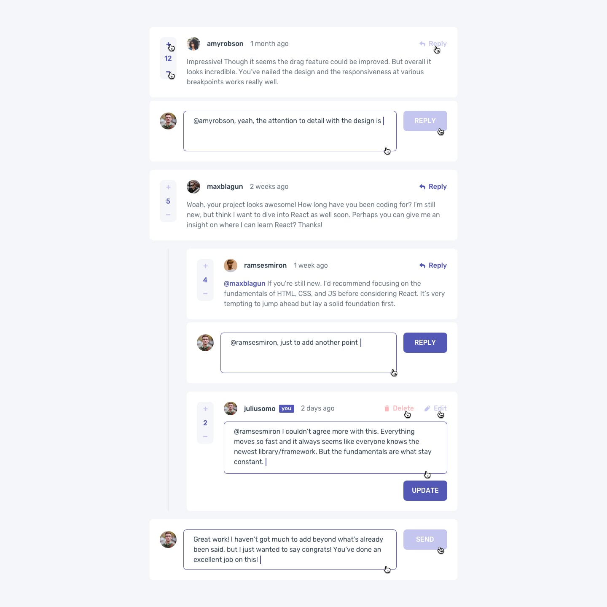
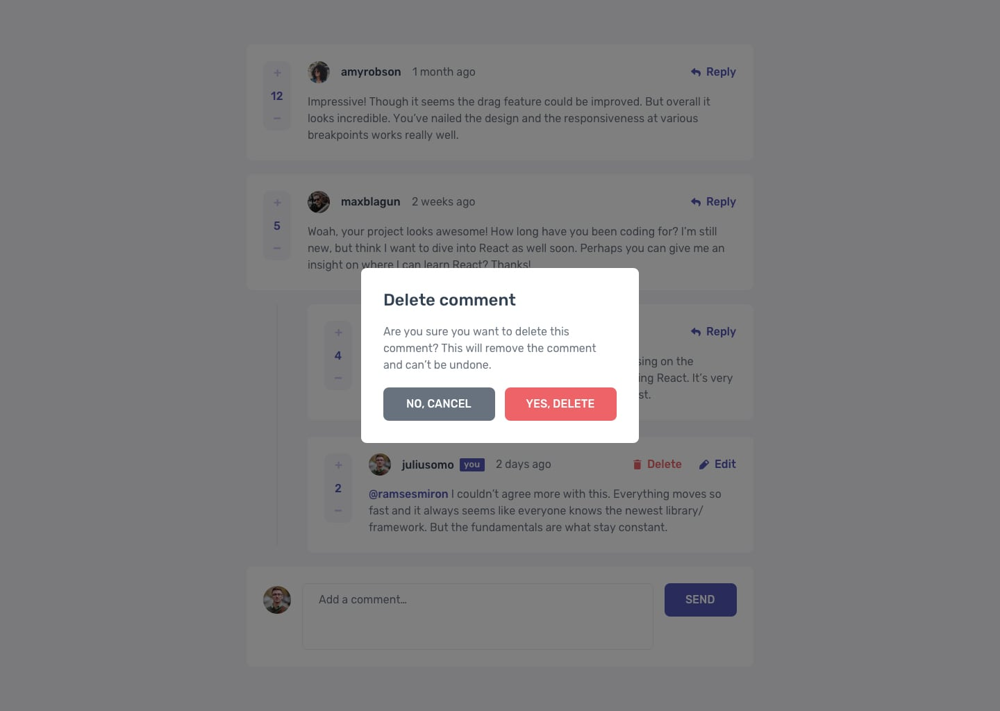
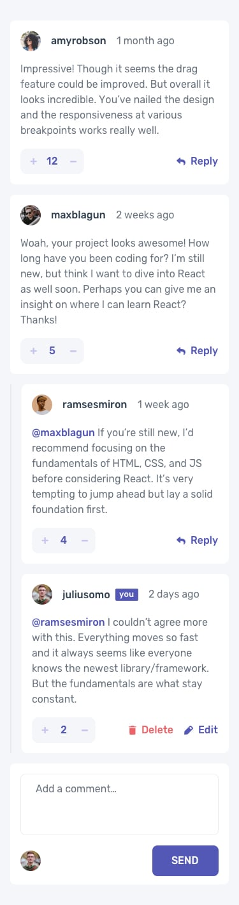

# Interactive comments section solution

This is a solution to the [Interactive comments section challenge on Frontend Mentor](https://www.frontendmentor.io/challenges/interactive-comments-section-iG1RugEG9). Frontend Mentor challenges help you improve your coding skills by building realistic projects. 

## Table of contents

- [Overview](#overview)
  - [The challenge](#the-challenge)
  - [Screenshot](#screenshot)
  - [Links](#links)
- [My process](#my-process)
  - [Built with](#built-with)
  - [What I learned](#what-i-learned)
  - [Continued development](#continued-development)
  - [Useful resources](#useful-resources)
- [Author](#author)
- [Acknowledgments](#acknowledgments)

**Note: Delete this note and update the table of contents based on what sections you keep.**

## Overview

### The challenge

Users should be able to:

- View the optimal layout for the app depending on their device's screen size
- See hover states for all interactive elements on the page
- Create, Read, Update, and Delete comments and replies
- Upvote and downvote comments
- **Bonus**: If you're building a purely front-end project, use `localStorage` to save the current state in the browser that persists when the browser is refreshed.
- **Bonus**: Instead of using the `createdAt` strings from the `data.json` file, try using timestamps and dynamically track the time since the comment or reply was posted.

### Screenshot







Add a screenshot of your solution. The easiest way to do this is to use Firefox to view your project, right-click the page and select "Take a Screenshot". You can choose either a full-height screenshot or a cropped one based on how long the page is. If it's very long, it might be best to crop it.

Alternatively, you can use a tool like [FireShot](https://getfireshot.com/) to take the screenshot. FireShot has a free option, so you don't need to purchase it. 

Then crop/optimize/edit your image however you like, add it to your project, and update the file path in the image above.

**Note: Delete this note and the paragraphs above when you add your screenshot. If you prefer not to add a screenshot, feel free to remove this entire section.**

### Links

- Solution URL: [Add solution URL here](https://your-solution-url.com)
- Live Site URL: [Add live site URL here](https://your-live-site-url.com)

## My process

### Built with

- Semantic HTML5 markup
- CSS custom properties
- Flexbox
- Vanilla js
- index database

- [React](https://reactjs.org/) - JS library
- [Next.js](https://nextjs.org/) - React framework
- [Styled Components](https://styled-components.com/) - For styles

**Note: These are just examples. Delete this note and replace the list above with your own choices**

### What I learned
 With this project 
 
- I made my first steps with web storage, i've been trough a lot of documentation about cache storage, local storage, cookies and so on ...
after learning i've finally choosen the index database to store comments because of its asynchronous aspect, and the fact i was dealing with json here ...
 
- I've also made my first steps with object oriented programming with js by building the "CommentQueue" class that is kinder similar to recyclerview adapter and view holder classes from android java.
 
- i've also gave a go to building something close to the  PWA; how?
    - As i said earlier, comment are stored in index database, but at the first load comment are imported from local json file called data.json witch could actually be a remote server that provide that same data. Then for future page load i check first data from index database and according to result i get back to datajson file or not.
    
     
Use this section to recap over some of your major learnings while working through this project. Writing these out and providing code samples of areas you want to highlight is a great way to reinforce your own knowledge.

To see how you can add code snippets, see below:

```html
<h1>Some HTML code I'm proud of</h1>
```
```css
.proud-of-this-css {
  color: papayawhip;
}
```
```js
class CommentQueue {
    constructor(currentUser, layout, commentArray) {
        this.layout = layout
        this.commentArray = commentArray
        this.currentUser = currentUser
        this.layout.innerHTML = ""
        this.renderComments(this.layout)
    }

    setComments(comments) {
        this.commentArray = comments
    }

    getComments() {
        return this.commentArray
    }

    addComment(comment) {
        this.commentArray.push(comment)
        this.layout.appendChild(this.bindCommentViewHolder(comment, (this.commentArray.length - 1), CommentQueue.commentViewHolder))
    }

    addReply(comment, rootCommentIndex) {
        this.commentArray[rootCommentIndex].replies.push(comment)
        let repliesQueueLayout = document.getElementById("comment-item-" + rootCommentIndex).getElementsByClassName("queue")[0]
        repliesQueueLayout.appendChild(this.bindReplyViewHolder(comment, (this.commentArray[rootCommentIndex].replies.length - 1), CommentQueue.replyViewHolder))
    }

    removeComment(commentIndex, replyIndex) {
        if (replyIndex !== null) { //means i'm trying to delete a reply to a comment
            this.commentArray[commentIndex].replies.splice(replyIndex, 1)
            let replyItem = document.getElementById("reply-item-" + replyIndex)
            let repliesQueue = replyItem.parentElement
            repliesQueue.removeChild(replyItem)
        } else { //i'm trying to delete a root comment
            this.commentArray.splice(commentIndex, 1)
            let commentItem = document.getElementById("comment-item-" + commentIndex)
            let commentsQueue = commentItem.parentElement
            commentsQueue.removeChild(commentItem)
        }
    }

    editComment(commentIndex, replyIndex, textContent){
        if (replyIndex === null){ //i'm editing a root comment comment
            this.commentArray[commentIndex].content = textContent
        }else { //im' editing a reply
            this.commentArray[commentIndex].replies[replyIndex].content = textContent
        }
        //no need to refresh the view since it already contains modifications
    }


    renderComments(layout) {
        this.commentArray.forEach((comment, index) => {
            layout.appendChild(this.bindCommentViewHolder(comment, index, CommentQueue.commentViewHolder))
        })
    }

    bindCommentViewHolder(comment, index, strViewHolder) {
        let parser = new DOMParser()
        let viewHolder = parser.parseFromString(strViewHolder, "text/html").getElementById("comment-item-id")
        viewHolder.setAttribute("id", "comment-item-" + index)

        let ownerAvatar = (viewHolder.getElementsByClassName("content")[0]).getElementsByClassName("avatar")[0].getElementsByTagName("img")[0]
        let currentUserAvatar = (viewHolder.getElementsByClassName("new-reply")[0]).getElementsByClassName("avatar")[0]
        let userNameLabel = (viewHolder.getElementsByClassName("header")[0]).getElementsByTagName("h4")[0]
        let ownershipLabel = (viewHolder.getElementsByClassName("header")[0]).getElementsByTagName("span")[0]
        let dateLabel = (viewHolder.getElementsByClassName("header")[0]).getElementsByTagName("span")[1]
        let paragraph = viewHolder.getElementsByClassName("text")[0]
        let scoreLabel = (viewHolder.getElementsByClassName("likes")[0]).getElementsByTagName("span")[0]

        let commentBtnDelete = viewHolder.getElementsByTagName("button")[0]
        let commentBtnReply = viewHolder.getElementsByTagName("button")[1]
        let commentBtnEdit = viewHolder.getElementsByTagName("button")[2]

        let commentBtnDeleteXs = viewHolder.getElementsByTagName("button")[3]
        let commentBtnReplyXs = viewHolder.getElementsByTagName("button")[4]
        let commentBtnEditXs = viewHolder.getElementsByTagName("button")[5]

        // let replyBtnSend = viewHolder.getElementsByTagName("button")[3]
        // let replyBtnDelete = viewHolder.getElementsByTagName("button")[4]
        // let replyBtnClose = viewHolder.getElementsByTagName("button")[5]

        if (this.currentUser.username === comment.user.username) {
            commentBtnDelete.classList = "show btn delete"
            commentBtnDeleteXs.classList = "show btn delete"
            commentBtnEdit.classList = "show btn secondary"
            commentBtnEditXs.classList = "show btn secondary"
            ownershipLabel.classList = "show"
            commentBtnReply.classList = "hide btn secondary"
            commentBtnReplyXs.classList = "hide btn secondary"
        } else {
            ownershipLabel.classList = "hide"
            commentBtnDelete.classList = "hide"
            commentBtnDeleteXs.classList = "hide"
            commentBtnEdit.classList = "hide"
            commentBtnEditXs.classList = "hide"
        }

        ownerAvatar.setAttribute("src", comment.user.image.webp)
        currentUserAvatar.setAttribute("src", this.currentUser.image.webp)
        userNameLabel.innerText = comment.user.username
        dateLabel.innerText = comment.createdAt
        paragraph.innerText = comment.content
        scoreLabel.innerText = comment.score
        this.renderReplies(viewHolder.getElementsByClassName("queue")[0], comment.replies)
        return viewHolder
    }

    renderReplies(repliesQueueLayout, repliesArray) {
        repliesArray.forEach((reply, index) => {
            repliesQueueLayout.appendChild(this.bindReplyViewHolder(reply, index, CommentQueue.replyViewHolder))
        })
    }

    bindReplyViewHolder(reply, index, strViewHolder) {
        let parser = new DOMParser()
        let viewHolder = parser.parseFromString(strViewHolder, "text/html").getElementById("reply-item-id")
        viewHolder.setAttribute("id", "reply-item-" + index)
        let ownerAvatar = (viewHolder.getElementsByClassName("content")[0]).getElementsByClassName("avatar")[0].getElementsByTagName("img")[0]
        let currentUserAvatar = (viewHolder.getElementsByClassName("new-reply")[0]).getElementsByClassName("avatar")[0]
        let userNameLabel = (viewHolder.getElementsByClassName("header")[0]).getElementsByTagName("h4")[0]
        let ownershipLabel = (viewHolder.getElementsByClassName("header")[0]).getElementsByTagName("span")[0]
        let dateLabel = (viewHolder.getElementsByClassName("header")[0]).getElementsByTagName("span")[1]
        let paragraph = viewHolder.getElementsByClassName("text")[0]
        let scoreLabel = (viewHolder.getElementsByClassName("likes")[0]).getElementsByTagName("span")[0]

        let commentBtnDelete = viewHolder.getElementsByTagName("button")[0]
        let commentBtnReply = viewHolder.getElementsByTagName("button")[1]
        let commentBtnEdit = viewHolder.getElementsByTagName("button")[2]

        let commentBtnDeleteXs = viewHolder.getElementsByTagName("button")[3]
        let commentBtnReplyXs = viewHolder.getElementsByTagName("button")[4]
        let commentBtnEditXs = viewHolder.getElementsByTagName("button")[5]

        // let replyBtnSend = viewHolder.getElementsByTagName("button")[3]
        // let replyBtnDelete = viewHolder.getElementsByTagName("button")[4]
        // let replyBtnClose = viewHolder.getElementsByTagName("button")[5]

        if (this.currentUser.username === reply.user.username) {
            commentBtnDelete.classList = "show btn delete"
            commentBtnDeleteXs.classList = "show btn delete"
            commentBtnEdit.classList = "show btn secondary"
            commentBtnEditXs.classList = "show btn secondary"
            ownershipLabel.classList = "show"
            commentBtnReply.classList = "hide btn secondary"
            commentBtnReplyXs.classList = "hide btn secondary"

        } else {
            ownershipLabel.classList = "hide"
            commentBtnDelete.classList = "hide"
            commentBtnDeleteXs.classList = "hide"
            commentBtnEdit.classList = "hide"
            commentBtnEditXs.classList = "hide"
        }

        ownerAvatar.setAttribute("src", reply.user.image.webp)
        currentUserAvatar.setAttribute("src", this.currentUser.image.webp)
        userNameLabel.innerText = reply.user.username
        dateLabel.innerText = reply.createdAt
        paragraph.innerText = reply.content
        scoreLabel.innerText = reply.score


        return viewHolder
    }

}

```

If you want more help with writing markdown, we'd recommend checking out [The Markdown Guide](https://www.markdownguide.org/) to learn more.

**Note: Delete this note and the content within this section and replace with your own learnings.**

### Continued development
With this chalenge and the implementation i made, i've touched a lot of topics that i actually want to dive a bit deeper to feel more confortable with them : 
- Using web storage to increase user experience quality on apps.
- Asynchronous javascript (assync / await), i should get used to them ...


Use this section to outline areas that you want to continue focusing on in future projects. These could be concepts you're still not completely comfortable with or techniques you found useful that you want to refine and perfect.

**Note: Delete this note and the content within this section and replace with your own plans for continued development.**

### Useful resources

- [Example resource 1](https://www.example.com) - This helped me for XYZ reason. I really liked this pattern and will use it going forward.
- [Example resource 2](https://www.example.com) - This is an amazing article which helped me finally understand XYZ. I'd recommend it to anyone still learning this concept.

**Note: Delete this note and replace the list above with resources that helped you during the challenge. These could come in handy for anyone viewing your solution or for yourself when you look back on this project in the future.**

## Author

- Frontend Mentor - [@yourusername](https://www.frontendmentor.io/profile/yourusername)
- Github  - [joseph penda](https://www.your-site.com)
- Twitter - [@marlonneazix](https://www.twitter.com/yourusername)
- Instagram - [@marlonneazix](https://www.twitter.com/yourusername)

**Note: Delete this note and add/remove/edit lines above based on what links you'd like to share.**

## Acknowledgments

This is where you can give a hat tip to anyone who helped you out on this project. Perhaps you worked in a team or got some inspiration from someone else's solution. This is the perfect place to give them some credit.

**Note: Delete this note and edit this section's content as necessary. If you completed this challenge by yourself, feel free to delete this section entirely.**
